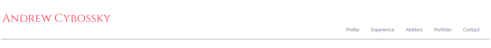

# milestone-project-01 User Centric Front-End Development / Portfolio
Milestone Project 01  Andrew Cybossky Portfolio
- 
- [Link to a deployed project](https://andrewskyboss.github.io/milestone-project-01/index.html)  Andrew Cybossky Portfolio website.

## Author
Andrej Cybovskij

## Project Overview
- Below is a picture of site that shows it in responsive states. 
[link to check a website to be responsive](http://ami.responsivedesign.is)

- The project idea is to create a personal portfolio website (for Andrej Cybovskij). 
	This websites goal is to represent Autor for potential Employers and Recruiters in a best light and get hired. 
    The main users of this website are a business people and their representatives. 
    The websites include of the following features: 
	- Educational overview and work experience. 
	- As well it presents Author's skills and relevant competencies.
	- Provides embedded portfolio examples and contact information for recruiters

- The main users of this website are a business people and their representatives. 
- Website design is clean and clear for Business people. 
- Clear structure makes it quick accessible and easy to use.
- All those features makes it highly efficient to achieve main target to be hired.

- [Link to a deployed website](https://andrewskyboss.github.io/milestone-project-01/index.html)

## UX

### Project Goals

The goals of this project are:
- Create a front-end web application based on the principles of user experience design, accessibility and responsivity.
- Develop and implement a static front-end web application using HTML and CSS.
- Create documentation to maximize code structure and organization  maintainability in the future.
- Use version control software to maintain and share code with other developers in a easiest way.
- Test and deploy web application to a Cloud platform for easy access from different sources.

#### User Goals

- The main users of this website are a business people and their representatives.
Write goals form the perspective of each user group of your website. Common types of users are:
- New customer or unauthenticate user main goal is to get all information they need as quick as possible.
- Existing customers knows website structure and could wondering for any updates and new information.
- Admin goal is to get access to the back end information to manage it.
- This website does not proposing any login system.

#### Developer Goals
- Create a front-end web application based on the principles of user experience design, accessibility and responsivity.
- Develop and implement a static front-end web application using HTML and CSS.
- Create project documentation.
- Use version control software to maintain and share code with other developers.
- Test and deploy web application to a Cloud platform.
- Demonstrate my abilities and knowledge i gained during my course.
- Get experience in a project development.

#### Website Owner Goals
Main goals of website owner are:
- To get a dream job.
- Represent himself to an potentional Employeers.
- Represent all needed information for a potential Employeers in a highly accessible way.
- To make information more structural.
- Showcase existing portfolios.
- Represent contact information to an employeers or customers.

### User Stories
In particular, as part of this section we recommend that you provide a list of User Stories, with the following general structure:
As a user type, I want to perform an action, so that I can achieve a goal.

### Design Choices
Your site is most likely geared to a certain audience and your design choices should tie into them. Let the assessors know your thought process.

This project was built based on UX concerns: website should be useful, usable and valuable for the customer and owner. As well to get a positive user experience, were used process of five planes of user experience:
- **Strategy**  – represents business goals. The main website owner goals were presented above. Just a reminder, that main user of this website will be a business people. Whole design should be kept simple in classical style with some bright elements (in this project Imperial Red color plays as bright element). Design should be plain and modern. Information should be well structured and easy to access. Main parts of the information are placed into top navigation. No more than 3 clicks to get information about website owner. Download button is placed in a footer navigation to get CV printable copy.

#### Colors
The main inspiration of the colors started from the Oxford Blue color. 
By the [empower-yourself-with-color-psychology.com website](https://www.empower-yourself-with-color-psychology.com/blue-in-business.html#:~:text=Blue%20is%20the%20most%20universally,indicates%20confidence%2C%20reliability%20and%20responsibility.) 
"Blue is the most universally favored color of all and therefore the safest to use. It relates to trust, honesty and dependability, therefore helping to build customer loyalty. Blue indicates confidence, reliability and responsibility"
- As a major color, the Oxford Blue (#0A0E29) is responsible to create a trust feeling from an employer to a potential employee. 
- Space Cadet (#2D325A) is a same blue group color and gives a variety and lighter shade. 
- Secondary color is Imperial Red (#F71735). As a shade of red, gives us feeling of energy, passion and action. It’s important to show a creativity and energy for a potential employer. 
- Accent color is Gold Metallic (#DBB13B). As a shade of yellow should create a feeling of success, achievement and triumph. 
- Pale Purple Pantone (#F1E4F3) color is a neutral and combines all colors together
- Combination of those colors should create emotional trust and future potential. Those feelings and website content should help the Author to achieve his goals to be hired.

- Color palete was created using [Coolors resources](https://coolors.co)
- 

#### Typography
- Raleway as an elegant sans-serif typeface family font, were using in this project for the body text.
- Cinzel font as based on classical proportion and were used for all titles in this project. Business people prefer classical fonts. It's very elegant as well.

- Body font is Raleway 16px. This body font size is common for many project as easy to read and good for design as well.
- All titles are in Cinzel font’s family. This font is based on classical Proportions and has variety of sizes. H1 as main title is in size of 40px. It is quite big size, but looks very elegant. H2 title is in size of 35px. H3 and H4 titles are in same size of 30px.
- All fonts are reduced in size for mobile devices to fit into the small screen of devices:
- H1 = 32px, H2 = 27px, H3 = 25px, H4 = 22px.
- body font is in same size for mobile devices.

- Font examples are presented below:
- H1 Cinzel 40px 
- H2 Cinzel 35px 
- H3 Cinzel 30px 
- H4 Cinzel 30px 
- Paragraph (body) Raleway 16px 
- [Cinzel font can be found here](https://fonts.google.com/specimen/Cinzel)
- [Raleway font can be found here](https://fonts.google.com/specimen/Raleway)
 

#### Images
- On website were used variety of images with open laptop screen. Open laptop looks like an open to opportunity. City views like a coding structure, organised and working properly.
- As well were used Font Awesome libraries icons to display all major social media. Icons takes small amount off space, but looks very presentable and modern.
- As well were used Programming languages svg icons to visualize them.

#### Design Elements
List of elements used on website: 
- top menu (desktop navigation)
- footer
- containers/section
- buttons
- text input
- textarea inputs
- progress bar
- dropdowns (mobile navigation)
- images (.png, .jpg, .svg)
- icons
- iframes

#### Animations and Transitions
- Project has fade in animation for h1 and h2 titles. Its draws attention to them. As well it's shows on About Me modules as a hover animation. 
- Hover state is used for all icons and logos. On hover icons are changing color and have a scale transformation.
- Programming languages logos have a grayscale filter. On hover grayscale filter is equal to zero and images have their original color. As well Logos have scale transformation.
- As well hover effect is added to top, footer navigation elements and Contact button. All those elements are changing background color.

### Wireframes
- Wireframes links are presented below:
- [Link to a Wireframes for a Desctop view](assets/documents/A.Cybovskij-Desctop.pdf)
- [Link to a Wireframes for Tablet and Mobile views ](assets/documents/A.Cybovskij-Tablet-mobile.pdf)

### Features
In this section, you should go over the different parts of your project, and describe each in a sentence or so.

#### Implemented Features
For some/all of your features, you may choose to reference the specific project files that implement them, although this is entirely optional.
It's easiest to break this section down into the header, footer, layer, and each page of your website. Call out any differences for mobile vs desktop presentations, include a screenshot.
Don't forget your 404 error page.

#### Future Features
Use this section to discuss plans for additional features to be implemented in the future:
If you end up not developing some of the features you hoped to implement, you can include those in this section.

## Technologies Used
In this section, you should mention all of the languages, frameworks, libraries, and any other tools that you have used to construct this project. For each, provide its name, a link to its official site and a short sentence of why it was used.
- If you included a js file that isn't your own, add it here.
- If you included a css file that isn't your own, add it here.
- Common 3rd party technologies to list:
- wirefames
- favicons
- color palette images
- fonts
- CSS Frameworks
- markdown tables
- markdown table of contents

### Programing Languages
- [JQuery](https://jquery.com) The project uses **JQuery** to simplify DOM manipulation.
- [CSS](https://www.w3schools.com/w3css/default.asp) The project uses **CSS** to define DOM appearance.
- [HTML](https://www.w3schools.com/html/default.asp) The project uses **HTML** to define DOM elements.
- [Markdown](https://www.markdownguide.org/) Documentation within the readme was generated using markdown

### Frameworks and Extensions
- [Bootstrap 4.0](https://getbootstrap.com/docs/4.0/getting-started/introduction/)
